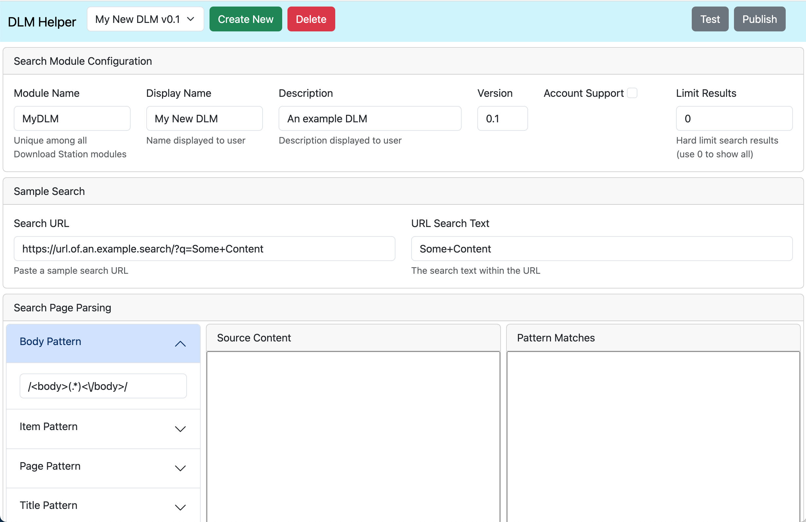

# About
DLM Helper is a web-based tool to easily create, test, and publish DLM search modules to expand the capability of Synology Download Manager. When used in conjunction with the DLM Webdriver Proxy, the DLMs created with DLM Helper can access websites which are normally protected from automated scripts.



# Installing DLM Helper
There are a couple options to install DLM Helper:
1. **Includes DLM WebDriver Proxy for more versatile DLMs.** Use Docker from the command line to launch DLM Helper with WebDriver Proxy included:
    1. Clone this repository and use Docker Compose to install/launch
        ```
        git clone http://github.com/SplitCriteria/dlm-helper.git
        sudo docker-compose up -d
        ```
    2. Go to `http://your.synology.ip:3000`
2. Use a PHP-enabled webserver (e.g. Synology Web Station); install from the command line (**Warning**: The Synology Web Station may limit the time allowed during DLM testing with time intensive web scraping which may result in an error after 60 seconds):
    1. Clone the files into your server's root directory
        ```
        git clone https://github.com/SplitCriteria/dlm-helper.git
        ```
    2. Install PHP WebDriver dependency (requires <a href="http://getcomposer.org">Composer</a>)
        ```
        cd dlm-helper
        php /your/path/to/composer.phar update
        ```
    3. Point your web browser to `http://your.synology.ip/dlm-helper/`
    4. If you want to manually run the DLM Webdriver Proxy
        - Use Docker Compose
        ```
        sudo docker compose -f docker-compose-proxy.yml up -d
        ```
        - Or, manually launch with Docker
        ```
        sudo docker network create dlm-net
        sudo docker run -dp 4445:4445 --name dlm-webdriver-proxy --network dlm-net splitcriteria/dlm-webdriver-proxy
        sudo docker run -d -p 4444:4444 -p 7900:7900 --shm-size="2g" --name selenium-webdriver --network dlm-net selenium/standalone-chrome
        ```

# Using WebDriver Proxy
The DLM WebDriver Proxy enables DLM modules, created using DLM Helper, to access websites which are normally protected from automated scripts. DLM WebDriver Proxy is **not** required to use DLM search modules which did not have `Use WebDriver Proxy` selected when published. The WebDriver Proxy can be used by itself by those who want to use DLM Search Modules configured for the WebDriver Proxy but do not want to create DLMs using DLM Helper.

# Creating DLM Search Modules using DLM Helper
Follow these steps to create and test your own DLM:

1. Go to `./index.html`
2. Create a new DLM or edit a previously made DLM
    - Note: Data is stored in your browsers storage; if you clear the browser data you will lose your data
3. Fill out the Configuration for your DLM
4. Go to a website and conduct a sample search
5. Copy/paste the URL of the search results (e.g. `https://some.website.com/search/?q=Search+Title`) into DLM Helper's Search URL input
6. Copy/paste the search string from the URL to the Search Text (e.g. `Search+Title`) input
    - Note: The source code of the website should load in the `Source Content` section
    - Note: Many websites protect their content from automated scripts. If the Source Content does not contain similar text to your sample search, then you may try installing DLM WebDriver Proxy and check the `Use WebDriver Proxy` checkbox in the Search Module Configuration
7. Use regular expressions in the Patterns section to isolate the search result items
    - Note: You may include a grouping in the regular expression, if more than 1 group is present only the first group is used
    - Note: The Body Pattern is optional and is used to narrow the source content (e.g. `/<body>(.*)<\/body>/s`)
    - **Note: Minimum required patterns are the Item, Title, and Download**
8. Confirm the desired content is present in the Pattern Matches section
9. Click the Test button to show sample results (results are artifically limited to 5)
10. Click the Publish button to create/download your DLM

## Notes
- DLM files are created using the Synology standard which is located on the [Synology website](https://global.download.synology.com/download/Document/DeveloperGuide/DLM_Guide.pdf)
- Account support (i.e. private trackers) is undocumented (as of Apr 2023), but details can be found on the [Synology forum](https://community.synology.com/enu/forum/1/post/159687)
- Internal caching is enabled by default which may cause an issue when switching to "Use WebDriver Proxy" (i.e. during DLM creation/testing, the old cached content will be used instead of the proxy). In this case you can open the Settings menu and either click "Clear Cache" or disable it entirely.

## Account Support
Support for private trackers, which require a username/password login, is now included. However, you will have to implement the the verification code yourself. Here are the steps to include account support

1. Select the "Account Support" checkbox prior to clicking Publish
2. Publish the DLM
3. Unpack the DLM `tar xzf your_dlm_file.dlm`
4. Edit `search.php`
5. Implement the appropriate account verification code in the `VerifyAccount` function
6. Repack your DLM `tar czf your_dlm_file.dlm INFO search.php`
7. On your Synology, open Download Station > Settings > BT Search
    1. Click Add and select your DLM
    2. Click Edit to add your username and password, then Verify to ensure the login works (this calls `VerifyAccount` in `search.php`)

## Debugging
- Error logs can be found at `/var/log/downloadstation.log`
- Username/password for accounts hashed/stored at `/usr/syno/etc/packages/DownloadStation/download/btsearch.conf`