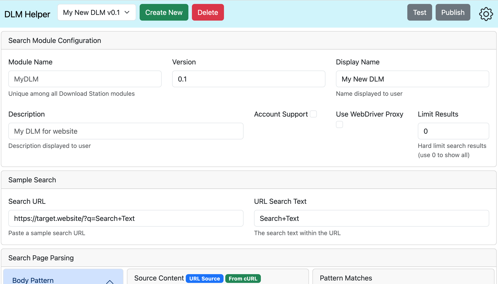

# About
DLM Helper is a web-based tool to quickly and easily create, test, and publish DLM search modules to expand the capability of Synology Download Manager.

# Instructions
Clone this repository onto any PHP enabled webserver (e.g. Synology WebStation) and go to `./index.html`. Follow these steps to create and test your own DLM:

1. Go to `./index.html` in your favorite web browser
2. Create a new DLM or edit a previously made DLM
    - Note: Data is stored in your browsers storage; if you clear the browser data you will lose your data
3. Fill out the Configuration for your DLM
4. Go to a torrent website and conduct a sample search
5. Copy/paste the URL of the search results (e.g. `https://some.torrent.website.com/search/?q=Search+Title`) into DLM Helper's Search URL input
6. Copy/paste the search string from the URL to the Search Text (e.g. `Search+Title`) input
    - Note: The source code of the website should load in the `Source Content` section
    - Note: Many torrent websites require Javascript or other plugins to function properly. DLM Helper currently does **NOT** support the creation of DLMs from those websites
7. Use regular expressions in the Patterns section to isolate the search result items
    - Note: You may include a grouping in the regular expression, if more than 1 group is present only the first group is used
    - Note: The Body Pattern is optional and is used to narrow the source content (e.g. `/<body>(.*)<\/body>/s`)
    - Note: The Item Pattern is **required** and is used to target each result (e.g. `/<tr>(.*?)<\/tr>/s`)
8. Confirm the desired content is present in the Pattern Matches section
9. Click the Test button to show sample results
10. Click the Publish button to create/download your DLM

## Notes
- DLM files are created using the Synology standard which is located on the [Synology website](https://global.download.synology.com/download/Document/DeveloperGuide/DLM_Guide.pdf)
- Account support (i.e. private trackers) is undocumented (as of Apr 2023), but details can be found on the [Synology forum](https://community.synology.com/enu/forum/1/post/159687)

## Account Support
Support for private trackers, which require a username/password login, is now included. However, you will have to implement the the verification code yourself. Here are the steps to include account support

1. Select the "Account Support" checkbox prior to clicking Publish
2. Publish the DLM
3. Unpack the DLM `tar xzf your_dlm_file.dlm`
4. Edit `search.php`
5. Implement the appropriate account verification code in the `VerifyAccount` function
6. Repack your DLM `tar czf your_dlm_file.dlm INFO search.php`
7. On your Synology, open Download Station > Settings > BT Search
    1. Click Add and select your DLM
    2. Click Edit to add your username and password, then Verify to ensure the login works (this calls `VerifyAccount` in `search.php`)